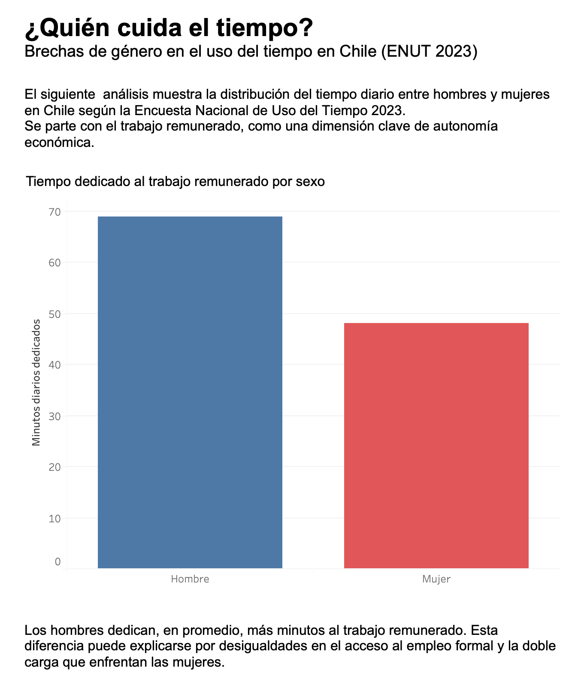
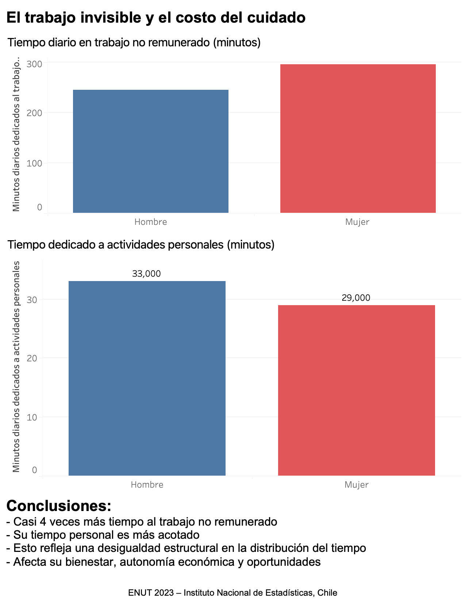

# 🕒 Brechas de Género en el Uso del Tiempo – ENUT 2023

Este proyecto analiza cómo hombres y mujeres en Chile distribuyen su tiempo entre trabajo remunerado, no remunerado y actividades personales, utilizando datos de la Encuesta Nacional de Uso del Tiempo (ENUT 2023).

## 🔍 ¿Qué muestra?

- **Dashboard 1**: Tiempo diario promedio dedicado al trabajo remunerado, comparado por sexo.
- **Dashboard 2**: Tiempo dedicado a trabajo no remunerado y actividades personales, según sexo.

## 📊 Herramienta utilizada

Visualización interactiva creada con **Tableau Public**.

## 🌐 Enlace al dashboard completo

👉 [Ver visualización interactiva en Tableau](https://public.tableau.com/views/brechas_genero_uso_tiempo_enut2023/Dashboard1)

## 🖼️ Vistas previas

### Trabajo remunerado

### Actividades no remuneradas y personales

---

📁 Datos utilizados: [ENUT 2023 – INE Chile](https://www.ine.gob.cl/estadisticas/sociales/uso-del-tiempo)

